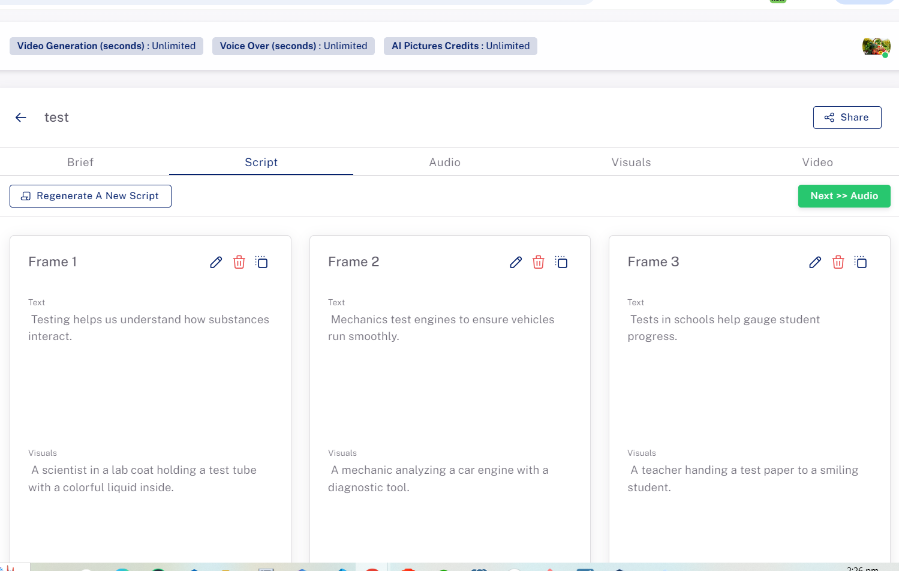
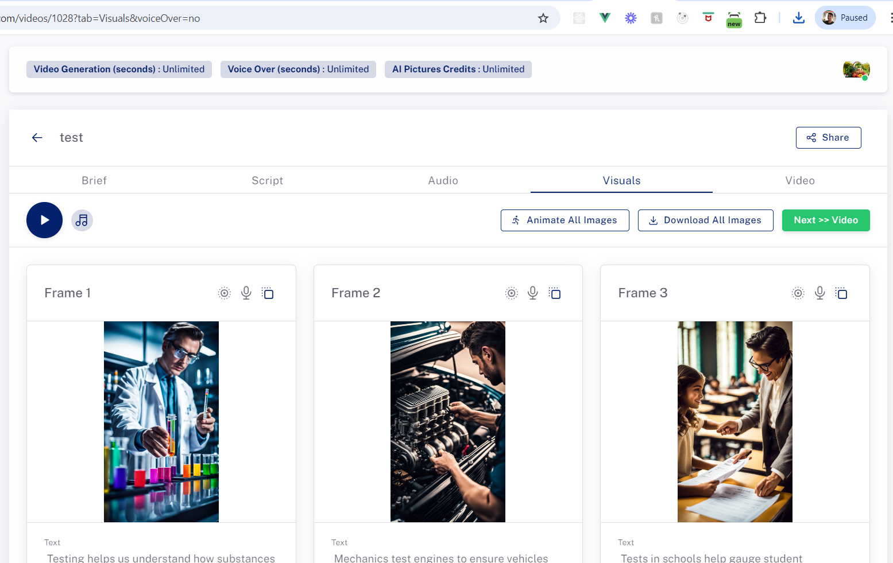

# Veeroll Package

This package allows you to create Veeroll videos using various modes, including express mode.

## Installation

To install the package, run the following command:

```bash
composer require veeroll-package/composer
```

## Configuration
After installing the package, add the VeerollServiceProvider to the providers array in config/app.php:

```
'providers' => ServiceProvider::defaultProviders()->merge([
    Veeroll\VeerollServiceProvider::class,
])->toArray(),
```
## run the command below
```
php artisan vendor:publish --provider="Vendor\Veeroll\VeerollServiceProvider"

```

##  Usage
Below is an example of how to create a Veeroll video:
( note that it will take some time before your images and voice overs will be generated, )
you can always check on key `frames` and `generating_vo` key if voice over is still on process 
and key `generating_ai_image` for images on process for ai generation 
```
use Vendor\Veeroll\Services\VideoService;

$params = [
    "picture_format_id" => 2,
    "duration" => 15, //min of 10 maximum 180(3 minutes) 
    "language_id" => 1,
    "voice_over" => 0, // true or false 
    "captions" => 1, // true or false
    "video_type_id" => 7,
    "video_tone_id" => 3,
    "name" => "test", 
    "topic" => "city lights", // topic of the video that will be used by the AI to generate contents
    "asset_type" => "express_mode", // express_mode => generate AI Images , stock_pictures => generate stock images , plain => solid backgrounds , stock_videos => generate stock videos
    "tone_id" => 1,
    "ai_style_id" => 8,
    "voice" => 1 // true or false
];

$veerollpackage = new VideoService();
$veerollpackage->createVideo($params);

```
## sample response after creating a video
```
 [
  "data" => array:60 [▼
    "id" => 227
    "company_id" => 1
    "picture_format_id" => 2
    "language_id" => 1
    "default_ai_voice_id" => null
    "music_tone_id" => 1
    "font_id" => 1
    "name" => "sdk backend"
    "topic" => "test topic"
    "duration" => 15
    "creation_type" => "express"
    "generating_ai_concept" => 0
    "is_active" => 1
    "public_url" => null
    "password" => null
    "pwd_protected" => 0
    "music" => 1
    "voice_over" => 0
    "captions" => 1
    "default_text_color" => "#ffffff"
    "default_highlight_color" => "#49f1c2"
    "default_text_position" => 50
    "default_scene_duration" => 30
    "default_font_size" => 60
    "default_font_outline_color" => "#000000"
    "default_outline_width" => 1
    "created_at" => "2024-08-22T06:25:16.000000Z"
    "updated_at" => "2024-08-22T06:25:16.000000Z"
    "created_by" => 5
    "updated_by" => 5
    "company_name" => "JANPAUL"
    "user_fullname" => null
    "aspect_ratio" => null
    "company" => array:28 [▶]
    "picture_format" => array:10 [▶]
    "language" => array:8 [▶]
    "default_ai_voice" => null
    "tags" => []
    "team" => []
    "users" => []
    "video_type_id" => 7
    "music_url" => "https://s3.us-west-2.amazonaws.com/dev-api.veeroll.com/music-library/4/MooveKa%20-%20Busy%20Day%20Ahead.mp3"
    "frames" => array:6 [▼
      0 => array:42 [▼
        "id" => 1641
        "sequence_nb" => 1
        "generating_ai_image" => 1
        "script" => " Ever wonder how new medicines are discovered?"
        "prompt" => " A scientist in a lab coat holding a test tube filled with a glowing blue liquid, examining it closely."
        "image_url" => null
        "ai_engine_used" => null
        "image_ai_error" => null
        "image_ai_payload" => null
        "vo_file" => null
        "font_id" => 1
        "text_color" => "#ffffff"
        "highlight_color" => "#49f1c2"
        "font_outline_color" => "#000000"
        "effect_id" => 3
        "outline_width" => 1
        "font_size" => 60
        "text_position" => 50
        "scene_duration" => null
        "video_id" => 227
        "ai_style_id" => null
        "ai_voice_id" => null
        "created_by" => 5
        "updated_by" => 5
        "created_at" => "2024-08-22T06:25:21.000000Z"
        "updated_at" => "2024-08-22T06:25:21.000000Z"
        "client_doodle_ref" => null
        "doodle_data" => null
        "deleted_at" => null
        "voice_over_duration" => null
        "frame_pict_versions" => []
        "comments" => []
        "background_color" => "#FF0081"
        "asset_type_id" => 4
        "keyword" => " scientist, test tube, laboratory"
        "generating_vo" => 0
        "needs_regenerate" => false
        "is_animated" => 0
        "animated_url" => null
        "generating_ai_video" => 0
        "error_ai_video" => null
        "needs_ai_video_regenerate" => false
      ]
      1 => array:42 [▼
        "id" => 1642
        "sequence_nb" => 2
        "generating_ai_image" => 1
        "script" => " It all starts with understanding our DNA."
        "prompt" => " A detailed close-up of a DNA strand modeled in 2D animation, rotating slowly."
        "image_url" => null
        "ai_engine_used" => null
        "image_ai_error" => null
        "image_ai_payload" => null
        "vo_file" => null
        "font_id" => 1
        "text_color" => "#ffffff"
        "highlight_color" => "#49f1c2"
        "font_outline_color" => "#000000"
        "effect_id" => 4
        "outline_width" => 1
        "font_size" => 60
        "text_position" => 50
        "scene_duration" => null
        "video_id" => 227
        "ai_style_id" => null
        "ai_voice_id" => null
        "created_by" => 5
        "updated_by" => 5
        "created_at" => "2024-08-22T06:25:21.000000Z"
        "updated_at" => "2024-08-22T06:25:21.000000Z"
        "client_doodle_ref" => null
        "doodle_data" => null
        "deleted_at" => null
        "voice_over_duration" => null
        "frame_pict_versions" => []
        "comments" => []
        "background_color" => "#FF0081"
        "asset_type_id" => 4
        "keyword" => " DNA, genetics, close-up"
        "generating_vo" => 0
        "needs_regenerate" => false
        "is_animated" => 0
        "animated_url" => null
        "generating_ai_video" => 0
        "error_ai_video" => null
        "needs_ai_video_regenerate" => false
      ]
      2 => array:42 [▼
        "id" => 1643
        "sequence_nb" => 3
        "generating_ai_image" => 1
        "script" => " Researchers analyze compounds to find breakthroughs."
        "prompt" => " A bustling research lab with multiple scientists working on different experiments."
        "image_url" => null
        "ai_engine_used" => null
        "image_ai_error" => null
        "image_ai_payload" => null
        "vo_file" => null
        "font_id" => 1
        "text_color" => "#ffffff"
        "highlight_color" => "#49f1c2"
        "font_outline_color" => "#000000"
        "effect_id" => 4
        "outline_width" => 1
        "font_size" => 60
        "text_position" => 50
        "scene_duration" => null
        "video_id" => 227
        "ai_style_id" => null
        "ai_voice_id" => null
        "created_by" => 5
        "updated_by" => 5
        "created_at" => "2024-08-22T06:25:21.000000Z"
        "updated_at" => "2024-08-22T06:25:21.000000Z"
        "client_doodle_ref" => null
        "doodle_data" => null
        "deleted_at" => null
        "voice_over_duration" => null
        "frame_pict_versions" => []
        "comments" => []
        "background_color" => "#FF0081"
        "asset_type_id" => 4
        "keyword" => " research lab, scientists, experiments"
        "generating_vo" => 0
        "needs_regenerate" => false
        "is_animated" => 0
        "animated_url" => null
        "generating_ai_video" => 0
        "error_ai_video" => null
        "needs_ai_video_regenerate" => false
      ]
      3 => array:42 [▼
        "id" => 1644
        "sequence_nb" => 4
        "generating_ai_image" => 1
        "script" => " Microscopic analysis is key in creating effective treatments."
        "prompt" => " A scientist looking at different colored samples through a microscope."
        "image_url" => null
        "ai_engine_used" => null
        "image_ai_error" => null
        "image_ai_payload" => null
        "vo_file" => null
        "font_id" => 1
        "text_color" => "#ffffff"
        "highlight_color" => "#49f1c2"
        "font_outline_color" => "#000000"
        "effect_id" => 4
        "outline_width" => 1
        "font_size" => 60
        "text_position" => 50
        "scene_duration" => null
        "video_id" => 227
        "ai_style_id" => null
        "ai_voice_id" => null
        "created_by" => 5
        "updated_by" => 5
        "created_at" => "2024-08-22T06:25:21.000000Z"
        "updated_at" => "2024-08-22T06:25:21.000000Z"
        "client_doodle_ref" => null
        "doodle_data" => null
        "deleted_at" => null
        "voice_over_duration" => null
        "frame_pict_versions" => []
        "comments" => []
        "background_color" => "#FF0081"
        "asset_type_id" => 4
        "keyword" => " microscope, analysis, samples"
        "generating_vo" => 0
        "needs_regenerate" => false
        "is_animated" => 0
        "animated_url" => null
        "generating_ai_video" => 0
        "error_ai_video" => null
        "needs_ai_video_regenerate" => false
      ]
      4 => array:42 [▼
        "id" => 1645
        "sequence_nb" => 5
        "generating_ai_image" => 1
        "script" => " Advanced computer models predict how drugs will work."
        "prompt" => " A computer screen displaying complex chemical structures and data graphs in 2D animation."
        "image_url" => null
        "ai_engine_used" => null
        "image_ai_error" => null
        "image_ai_payload" => null
        "vo_file" => null
        "font_id" => 1
        "text_color" => "#ffffff"
        "highlight_color" => "#49f1c2"
        "font_outline_color" => "#000000"
        "effect_id" => 3
        "outline_width" => 1
        "font_size" => 60
        "text_position" => 50
        "scene_duration" => null
        "video_id" => 227
        "ai_style_id" => null
        "ai_voice_id" => null
        "created_by" => 5
        "updated_by" => 5
        "created_at" => "2024-08-22T06:25:21.000000Z"
        "updated_at" => "2024-08-22T06:25:21.000000Z"
        "client_doodle_ref" => null
        "doodle_data" => null
        "deleted_at" => null
        "voice_over_duration" => null
        "frame_pict_versions" => []
        "comments" => []
        "background_color" => "#FF0081"
        "asset_type_id" => 4
        "keyword" => " computer model, chemical structures, data graphs"
        "generating_vo" => 0
        "needs_regenerate" => false
        "is_animated" => 0
        "animated_url" => null
        "generating_ai_video" => 0
        "error_ai_video" => null
        "needs_ai_video_regenerate" => false
      ]
      5 => array:42 [▼
        "id" => 1646
        "sequence_nb" => 6
        "generating_ai_image" => 1
        "script" => " And that’s how lives are transformed, one discovery at a time."
        "prompt" => " A happy patient leaving a hospital, waving goodbye to the medical staff."
        "image_url" => null
        "ai_engine_used" => null
        "image_ai_error" => null
        "image_ai_payload" => null
        "vo_file" => null
        "font_id" => 1
        "text_color" => "#ffffff"
        "highlight_color" => "#49f1c2"
        "font_outline_color" => "#000000"
        "effect_id" => 3
        "outline_width" => 1
        "font_size" => 60
        "text_position" => 50
        "scene_duration" => null
        "video_id" => 227
        "ai_style_id" => null
        "ai_voice_id" => null
        "created_by" => 5
        "updated_by" => 5
        "created_at" => "2024-08-22T06:25:21.000000Z"
        "updated_at" => "2024-08-22T06:25:21.000000Z"
        "client_doodle_ref" => null
        "doodle_data" => null
        "deleted_at" => null
        "voice_over_duration" => null
        "frame_pict_versions" => []
        "comments" => []
        "background_color" => "#FF0081"
        "asset_type_id" => 4
        "keyword" => " patient, hospital, recovery"
        "generating_vo" => 0
        "needs_regenerate" => false
        "is_animated" => 0
        "animated_url" => null
        "generating_ai_video" => 0
        "error_ai_video" => null
        "needs_ai_video_regenerate" => false
      ]
    ]
    "exports" => []
    "video_tone_id" => 1
    "default_effect_id" => 8
    "total_voice_overs_duration" => 0
    "target_audience" => null
    "add_cta" => null
    "cta" => null
    "has_changes" => null
    "brief_changed" => null
    "settings_changed" => null
    "default_background_color" => "#FF0081"
    "total_comments" => 0
    "text_effect_id" => 2
    "needs_regenerate" => false
    "has_frames_with_voice_over" => false
    "logo_enabled" => false
    "logo_position" => null
  ]
  "message" => "Video created successfully"
]

``` 

## Below is an example of how to update a Veeroll video:

```
use Vendor\Veeroll\Services\VideoService;

$params = [
    "picture_format_id" => 2,
    "duration" => 15, //min of 10 maximum 180(3 minutes) 
    "language_id" => 1,
    "voice_over" => 0, // true or false 
    "captions" => 1, // true or false
    "video_type_id" => 7,
    "video_tone_id" => 3,
    "name" => "test", 
    "topic" => "city lights", // topic of the video that will be used by the AI to generate contents
    "asset_type" => "express_mode", // express_mode => generate AI Images , stock_pictures => generate stock images , plain => solid backgrounds , stock_videos => generate stock videos
    "tone_id" => 1,
    "ai_style_id" => 8,
    "voice" => 1 // true or false
];

$videoId = 2;
$veerollpackage = new VideoService();
$veerollpackage->updateVideo($params,$videoId);

```


## how to fetch details of created video

```
use Vendor\Veeroll\Services\VideoService;


$veerollpackage = new VideoService();
$videoId = 2;
$veerollpackage->getVideo($videoId);

```


## Below is an example of how to generate a video once all your voice overs or images are generated,
you can always check on the key `exports` if the video is done being generated and your generated history of videos, you can always check the `status` key if its finished

```
use Vendor\Veeroll\Services\VideoService;


$veerollpackage = new VideoService();
$videoId = 2;
$veerollpackage->generateVideo($videoId);

```

## your visuals and script will be on key `frames` on the response data (sample images on veeroll website)





## available picture_format_ids
```
ID  Label              Aspect Ratio  Width  Height

1   Square (1:1)       1:1           1024   1024
2   Vertical (9:16)    9:16          768    1344
3   Wide (16:9)        16:9          1344   768
```

## available language_id

```
ID  Label               Language

1   English             English US
2   English UK          English UK
3   Portuguese          Portuguese
4   Spanish             Spanish
5   French              French
6   German              German
7   Italian             Italian
8   Dutch               Dutch
9   Bahasa Indonesia    Bahasa Indonesia
10  Mandarin            Mandarin
11  Filipino            Filipino
12  Latin edit          Latin

```

## available video_type_id

```
ID  Label

1   Fun facts
2   Listicle
3   Tips
4   Education
5   Short-story
6   Motivation
7   Default

```

## available video_tone_id

```
ID  Label            Tone

1   Corporate        The video style is corporate.
2   Marketing        The video purpose is for marketing.
3   Casual           The video tone should be casual.
4   Energetic        The video tone should be energetic.
5   Educational      The video style is educational.
6   Intriguing       The video tone should be intriguing.
7   Humorous         The video tone should be humorous.
8   Serious          The video tone should be serious.
9   Inspirational    The video should be inspirational.
10  Motivational     The video style should be motivational.
11  Dramatic         The video style should be dramatic.
12  Joyful           The video tone should be joyful.

```

## available ai_style_id , this is for the visuals ( images / videos)
```
ID  Label               Style           Description

1   Pencil sketch       Line-art        Black and white hand-drawn pencil sketch
2   Comic Book          Comic-book      Colored comic book style drawing
3   Anime               Anime           Colored anime style drawing
4   2D isometric        Isometric       2D isometric style
5   Photo realistic     Photographic    Photo realistic picture
6   Origami             Origami         Origami style drawing
7   Pixel art           Pixel-art       Pixel art style drawing
8   Movie style         Cinematic       Movie style picture
9   Colour marker       Digital-art     Colour marker style sketch
10  Neon                Neon-punk       Neon style drawing
11  3D model            3D-model        3D render picture
12  Sepia               Line-art        Sepia hand-drawn pencil sketch
13  Watercolor          Line-art        Watercolor drawing
14  Fantasy             Digital-art     Fantasy drawing
15  Polygon             Digital-art     Polygon style drawing
16  2D Flat             Enhance         2D explainer video-style picture (flat:0.9, minimal:0.9, simple shapes:0.9)


```

## available tone_id ( music_tones)
```
ID  Label

1   Carefree
2   Epic
3   Exciting
4   Funny
5   Groovy
6   Happy
7   Love
8   Mysterious
9   Peaceful
10  Uplifting


```
## Note: when you have updated your `topic` you need to update your `frames` content,  to do that 

```
use Vendor\Veeroll\Services\VideoService;


$veerollpackage = new VideoService();
$videoId = 2;
$veerollpackage->generateAIcontent($videoId);

```


## Environment Variables
Make sure to set the following environment variables in your .env file:

```
VEEROLL_SECRET=your-secret-value
VEEROLL_API_KEY=your-api-key
```